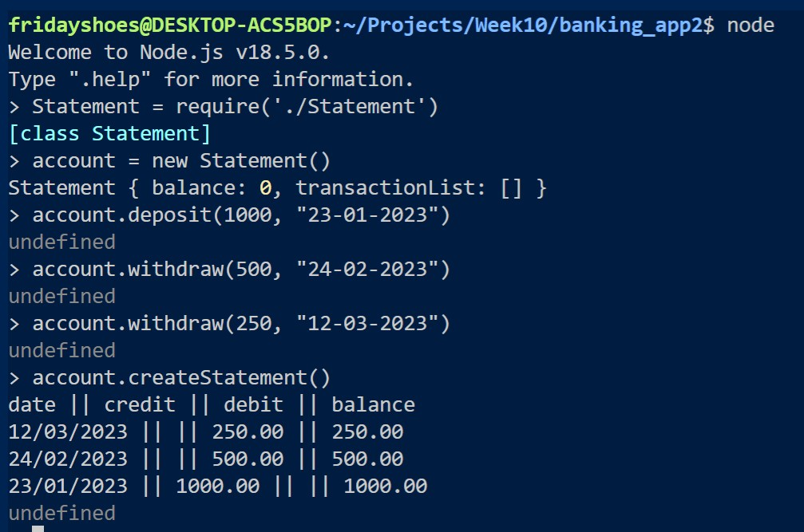

# Bank tech test

## Specification

### Requirements

- You should be able to interact with your code via a REPL like IRB or Node. (You don't need to implement a command line interface that takes input from STDIN.)
- Deposits, withdrawal.
- Account statement (date, amount, balance) printing.
- Data can be kept in memory (it doesn't need to be stored to a database or anything).

### Acceptance criteria

**Given** a client makes a deposit of 1000 on 10-01-2023  
**And** a deposit of 2000 on 13-01-2023  
**And** a withdrawal of 500 on 14-01-2023  
**When** she prints her bank statement  
**Then** she would see

```
date || credit || debit || balance
14/01/2023 || || 500.00 || 2500.00
13/01/2023 || 2000.00 || || 3000.00
10/01/2023 || 1000.00 || || 1000.00
```

### Designing the Class System

- TransactionDetails Class - Used to indetify the conponents of the transaction (date, amount, type of transaction(deposit or withdraw) and balance amount)

- Statement Class - Accepts TransactionDetails, updates Balance and outputs a statement of the transactions and account balance at each transaction stage.

## Getting Started

### Installation

The application has been buil on Node.js. To install Node run the command below:

npm install -g npm

Jest has been used for testing and Eslint to find and detect issues within the Javascript code. These dependencies are listed within the package.json and can therefore be installed using the command below.

npm install

### Running the program

The program can be launched via Node

node
Statement = require('./Statement')
account = new Statement()

Once we have instantiated an instance of the class, we can begin using the various functions, such as deposit, withdrawal and printing statement.

account.deposit(1000, "23-01-2023")
account.withdraw(500, "24-02-2023")
account.withdraw(250, "12-03-2023")
account.createStatement()

Expected Output

date || credit || debit || balance
12/03/2023 || || 250.00 || 250.00
24/02/2023 || || 500.00 || 500.00
23/01/2023 || 1000.00 || || 1000.00

## Screenshots


